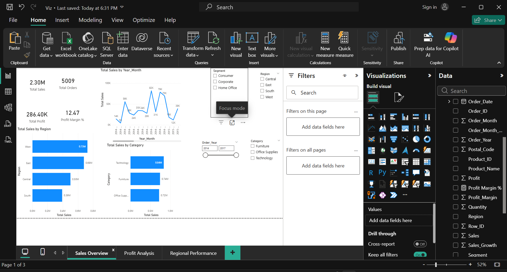
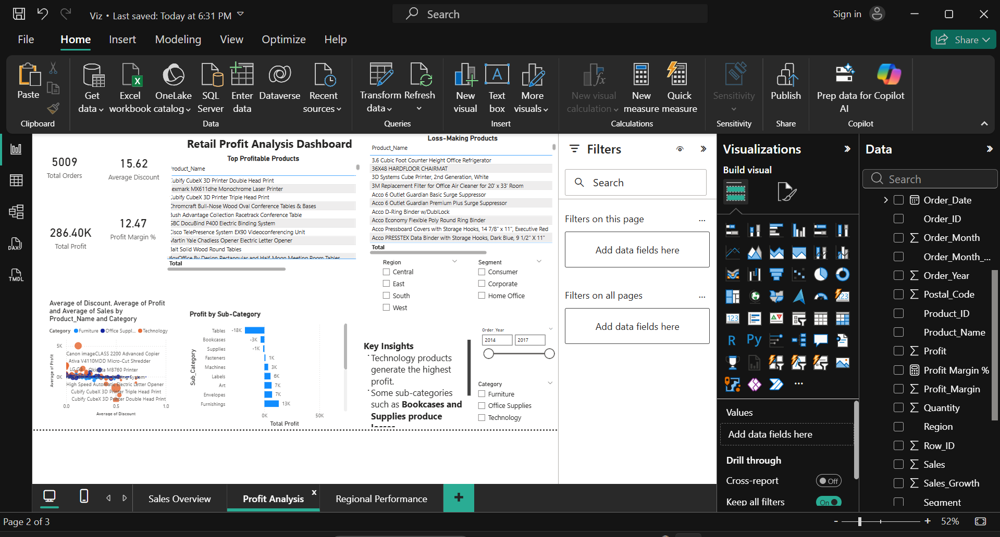
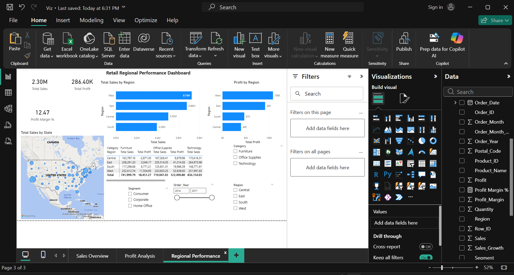

# Retail Sales and Profit Optimization Analysis

## Project Overview
This project analyzes retail sales data to identify the main factors influencing revenue and profitability.  
The analysis focuses on understanding how product categories, discounts, and regional performance impact business outcomes.

The project combines Python, SQL, and Power BI to transform raw data into meaningful business insights.

---

## Tools Used

- Python (Pandas)
- SQL (Microsoft SQL Server Management Studio)
- Power BI
- GitHub

---

## Dataset

The dataset used in this project is the Superstore Retail Dataset.

It contains information about:

- Sales transactions
- Product categories
- Customer segments
- Regional sales
- Profit and discounts

Important variables include:

- Sales
- Profit
- Discount
- Category
- Sub-Category
- Region
- State
- Order Date

---

## Data Preparation

The dataset was cleaned and prepared using Python.

Main steps included:

- Removing duplicate records
- Converting date columns to datetime format
- Handling missing values
- Creating new features such as:

  - Profit Margin
  - Order Year
  - Order Month
  - Sales Growth

The cleaned dataset was saved for further analysis.

---

## SQL Analysis

SQL queries were used to answer key business questions:

- Which region generates the highest sales?
- Which product categories generate the most profit?
- Which sub-categories produce losses?
- What is the monthly revenue trend?

Example query:

```sql
SELECT Region,
SUM(Sales) AS Total_Sales,
SUM(Profit) AS Total_Profit
FROM superstore_clean
GROUP BY Region
ORDER BY Total_Sales DESC;
```

---

## Power BI Dashboard

An interactive dashboard was created with three pages.

### Sales Overview
Shows overall sales performance including:
- Total Sales
- Total Profit
- Profit Margin
- Sales by Category
- Monthly Sales Trend

### Profit Analysis
Analyzes profitability drivers including:
- Profit by Sub-Category
- Discount vs Profit relationship
- Top profitable products
- Loss-making products

### Regional Performance
Examines geographical sales patterns including:
- Sales by Region
- Profit by Region
- Sales distribution by State
- Category performance across regions

---

## Key Insights

Some important insights from the analysis:

- The **West region generates the highest sales and profit**.
- The **Technology category contributes the highest profit margin**.
- Some sub-categories such as **Bookcases and Supplies generate negative profit**.
- Higher discount levels are associated with **lower profitability**.

---

## Dashboard Preview







---

## Author

Prabin Pokhrel  
Master’s in Business Intelligence  
Dalarna University
